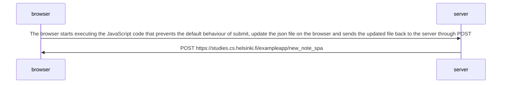

```mermaid
sequenceDiagram
    participant browser
    participant server

    browser->>server: The browser starts executing the JavaScript code that prevents the default behaviour of submit, update the json file on the browser and sends the updated file back to the server through POST

    server->>browser: POST https://studies.cs.helsinki.fi/exampleapp/new_note_spa

```
